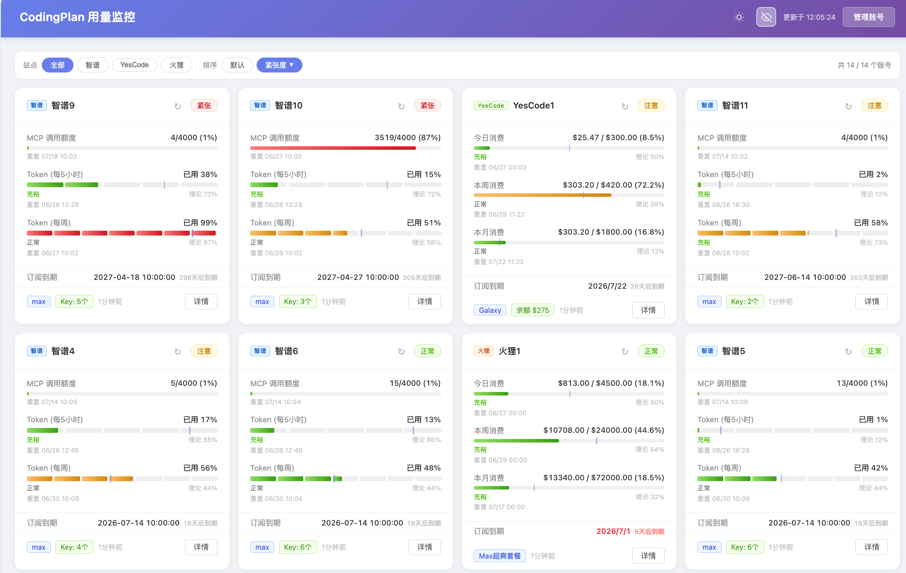

# GLM 用量监控

多账号 API 用量监控面板,支持 **智谱 GLM(bigmodel.cn)**、**YesCode(co.yes.vg)**、**火狸(huolilink.com)**、**火山(AgentPlan / CodingPlan 同一登录会话)**、**智云(token.telecomjs.com)** 等账号,以卡片 + 用量曲线的形式集中展示额度消耗、余额、订阅到期、API Key 管理。

## 效果展示



## 项目结构

```
glm-usage/
├── server.js              # Express 入口:静态托管 + 挂载 api 中间件
├── api.js                 # 后端:账号凭证读写、用量/到期/Key 代理(5 分钟缓存)
├── config.js              # 配置中心:加载 .env 并导出不可变配置(port/host/密码等)
├── accounts.json          # 账号凭证(运行时自动生成,敏感,.gitignore 已忽略)
├── .env.example           # 环境变量模板(复制为 .env 后生效,.gitignore 已忽略)
├── Dockerfile             # 容器镜像构建(node:22-alpine)
├── docker-compose.yml     # 一键编排(.env 注入 + ./data 数据持久化)
├── package.json
└── public/
    ├── index.html         # 前端监控面板(原 usage.html)
    └── js/echart/
        └── echarts.min.js # 用量曲线依赖(本地,可离线)
```

## 快速开始

```bash
npm install
cp .env.example .env       # 可选:按需修改 .env 中的端口 / 密码
npm start
# 默认 http://localhost:4000
```

首次启动会自动创建空的 `accounts.json`,无需手动准备数据文件。打开页面后点击右上角 **「管理账号」**,逐个录入账号即可(支持粘贴浏览器 fetch / cURL 命令自动解析凭证),后端落盘到 `accounts.json`。

## 配置

通过 `.env` 文件配置,模板见 `.env.example`(`cp .env.example .env` 后生效)。`.env` 已加入 `.gitignore`,不会提交。所有项均有默认值:

| 变量 | 默认值 | 说明 |
|------|--------|------|
| `PORT` | `4000` | 监听端口 |
| `HOST` | `0.0.0.0` | 监听地址,默认允许局域网访问 |
| `ADMIN_PASSWORD` | `123456` | 管理密码(账号增删改、Key 复制/创建/删除需校验) |
| `ACCOUNTS_FILE` | `./accounts.json` | 账号数据文件路径(Docker 持久化用,本地留空) |
| `NODE_ENV` | `development` | 运行环境 |
| `TELECOMJS_CHROME_PATH` | 自动发现 | 智云抓取所用 Chrome/Chromium 可执行文件路径 |

`.env` 示例:

```env
PORT=4000
HOST=0.0.0.0
ADMIN_PASSWORD=my-secret
```

> 仍可用命令行 / 系统环境变量覆盖(`PORT=5000 npm start`),优先级:系统环境变量 > `.env` > 默认值。
> 浏览器验证通过后,密码保存在本地 `localStorage`,仅在当前浏览器生效。

## Docker 部署

镜像基于 `node:22-alpine`,并安装 Chromium 供智云页面完成瑞数校验。账号数据通过宿主机 `./data` 目录持久化,`.env` 通过 `env_file` 注入容器。

```bash
cp .env.example .env          # 先准备 .env 并修改 ADMIN_PASSWORD
docker compose up -d --build  # 构建并后台启动
# 访问 http://localhost:4000

docker compose logs -f        # 查看日志
docker compose down           # 停止并移除容器(./data 账号数据保留)
```

说明:
- 改 `.env` 的 `PORT` 后,`docker-compose.yml` 的端口映射会自动跟随(两端均读 `${PORT}`);生效需重建:`docker compose up -d`。
- 账号数据落盘在宿主机 `./data/accounts.json`,容器删除/重建不丢失;彻底清空请删除 `./data` 目录。
- `.env` 不会被打入镜像(`.dockerignore` 已排除),密码只存在于运行时环境。

### 一键脚本 deploy.sh

封装了上述常用操作,免去记忆 docker compose 参数:

```bash
./deploy.sh start     # 构建并启动
./deploy.sh stop      # 停止并移除容器(./data 数据保留)
./deploy.sh restart   # 重启(不重新构建)
./deploy.sh status    # 查看状态
./deploy.sh logs      # 查看日志(Ctrl+C 退出不停止服务)
./deploy.sh update    # git pull + 重新构建启动
```

## 账号类型与凭证

在面板右上角「管理账号」中添加,支持粘贴 fetch / cURL 命令自动解析。

| 平台 | 必填凭证 | 抓取方式 |
|------|----------|----------|
| 智谱 GLM | `authorization`(JWT)、`organization`、`project` | bigmodel.cn 任意请求头中的 `authorization` / `bigmodel-organization` / `bigmodel-project` |
| YesCode | `cookie` | co.yes.vg 请求中的完整 `Cookie` |
| 火狸 | `authorization`(Bearer)、可选 `huoli_email` + `huoli_password` | huolilink.com 请求头中的 `Authorization`;填了邮箱密码时 token 过期会自动重新登录 |
| 火山(AgentPlan=火山A / CodingPlan=火山C) | `cookie`、`csrf`、可选 `web_id`、`planType` | console.volcengine.com 请求(用 cURL 复制带出完整 Cookie);添加账号时选套餐类型:AgentPlan 抓 `GetAgentPlanAFPUsage`,CodingPlan 抓 `GetCodingPlanUsage`。两者同一登录会话,Cookie/CSRF 共用 |
| 智云 | `satoken`、`phone` | 可手动填写 token.telecomjs.com 请求头中的 `Satoken`;认证失效时卡片会提供重新登录入口，用户核对账号登记手机号后使用官方二维码扫码登录，成功后自动回写。后端通过 Chrome 执行页面及瑞数脚本并查询余额 |

## 后端 API

`api.js` 以 `/api` 为前缀暴露以下接口(供前端 `index.html` 调用):

| 方法 | 路径 | 鉴权 | 说明 |
|------|------|------|------|
| POST | `/api/auth` | - | 校验管理密码 |
| GET  | `/api/usage` | - | 全部账号用量(5 分钟缓存,`?force=1` 强刷) |
| GET  | `/api/usage/:index` | - | 单账号用量 |
| GET  | `/api/keys/:index` | - | 智谱账号 API Key 列表 |
| GET  | `/api/keys/:index/copy/:apiKey` | ✅ | 复制 Key 明文 |
| POST | `/api/keys/:index` | ✅ | 创建 Key |
| DELETE | `/api/keys/:index/:apiKey` | ✅ | 删除 Key |
| GET  | `/api/accounts` | ✅ | 账号列表 |
| POST / PUT / DELETE | `/api/accounts[/:index]` | ✅ | 账号增改删 / 整体排序 |
| GET  | `/api/model-usage/:index?period=today\|7d\|30d` | - | 智谱用量曲线 |
| GET  | `/api/expire[/:index]` | - | 订阅到期时间(24 小时缓存) |
| GET  | `/api/weights` | 可选密码 | 公开账号 token 分配权重(0~10,纯读缓存) |

鉴权接口通过请求头 `X-Auth-Password` 传递管理密码。

## 权重接口(`/api/weights`)

为中转站提供 token 分配权重:返回 `{ "账号名": 权重, ... }`,**权重 0~10**,越高越宽裕、可多分配 token,0 = 已耗尽。

**缓存依赖(关键)**:接口纯读内存缓存评分,**绝不会因调用而向 bigmodel.cn 刷新**。缓存由「打开监控面板 → `/api/usage`」填充,5 分钟 TTL。

**默认权重兜底**:token 失效 / 无缓存时,该账号按其「默认权重」配置返回(而非跳过)。默认权重初值 1,可逐账号配置。

智云按量账号会出现在权重接口和权重配置中。扫码登录是内存中的临时会话，5 分钟后自动过期；创建会话前必须输入与账号 `phone` 字段一致的手机号。二维码由智云官方页面提供，本项目只保存最终返回的 `satoken`。

**密码分层**:
- 不带密码:`GET /api/weights` → 公开账号(`isPublic !== false`,未明确设为私有即默认公开)
- 带正确密码:`GET /api/weights?password=<ADMIN_PASSWORD>` → 全部账号
- 明细:`GET /api/weights?password=<PWD>&detail=1` → `{ weights, detail:[...], generatedAt, cacheTtlMs }`(需密码)；智云明细额外包含 `remainingDays`、`averageDaily`、`capacityScore`、`codingPressure`、`timeMultiplier`、`peak`

**计算流程**:
1. **CodingPlan base(0~6)**:各平台按 5 小时、周、月等有效窗口的实际消耗速度与理论进度评分，取最紧张窗口；任一有效窗口耗尽则为 0
2. **智云 base**:`(账户余额 + 赠金) ÷ 近7日有消费日期的日均消费` 得到预计可用天数，按 `<7 / <14 / <30 / <60 / <90 / ≥90 天` 映射为容量分 `1~6`；再乘 CodingPlan 压力系数 `1 + (6 - CodingPlan平均基础分) / 6`，最后按中国时间 `14:00~18:00` 乘 `2`，其他时段乘 `0.5`。余额为 0 时恒为 0；有余额但暂无历史消费时容量分为 6
3. **策略**(在 base 上叠加,默认 B 倍率 ×1)
4. **兜底**:base 为 null 时直接用默认权重
5. **钳制**:最终结果统一 `clamp [0, 10]` 并保留 1 位小数

**权重策略**(每账号可配,管理员):

| 策略 | 含义 | 计算(base 已知时) |
|------|------|------|
| A 固定值 | 直接返回设定值 | `value` |
| B 倍率(默认 ×1) | 按倍率缩放 | `base × value` |
| C 最高值 | 上限钳制 | `min(base, value)` |
| D 固定加减 | 增减 | `base + value` |

**配置接口**(管理员,请求头 `X-Auth-Password`):
- `GET /api/weights/config` → `[{index, name, platform, config:{defaultWeight,strategy,value}, base, final}]`
- `PUT /api/weights/config/:index`,body `{defaultWeight?, strategy?, value?}`(任选提供)→ 写入该账号 `weightConfig`(存 `accounts.json`,编辑账号时自动保留)

**前端**:管理员登录后,每张卡片左上角显示 `W {最终权重}` 徽标(配色:0 红 / 1-3 橙 / 4-7 蓝 / 8-10 绿),点击弹出权重配置(默认权重 + 策略 + 策略值 + 实时预览),保存后徽标即时刷新;非管理员不显示。

## 前端功能

- 卡片视图:各账号额度进度、紧张度(实际用量 vs 理论进度)、重置时间、订阅到期倒计时
- 智谱个人账号重置提醒:周用量达到 60%、未耗尽、明显超出理论进度，且预计会在官方重置前至少停用 1 天时标记「需要重置」；团队账号与任一额度已耗尽的账号不提示
- 站点筛选(全部 / 智谱 / YesCode / 火狸 / 火山 / 智云)+ 紧张度排序
- 详情弹窗:负责人信息、余额、消费周期、API Key 表格、用量曲线(echarts)
- 深色模式(从按钮处径向扩散动画)+ 隐私模式(隐藏账号名)
- 账号管理:拖拽排序、粘贴 fetch/cURL 快速导入

## 注意事项

- `accounts.json` 与 `.env` 均含明文凭证 / 密码,切勿提交到公开仓库(均已加入 `.gitignore`);`accounts.json` 删除后重启会自动重建空文件。
- 所有对 bigmodel.cn / co.yes.vg / huolilink.com 的请求由服务端代理转发,浏览器不直接持有凭证。
- 凭证(JWT / Cookie / Token)会过期,失败时面板显示「请求失败」;智谱需重新抓 token,YesCode 需重抓 Cookie,火狸若配了邮箱密码会自动续登,火山需重抓 Cookie/CSRF,智云认证失败时可从卡片核对手机号并重新登录，自动更新 Satoken。
