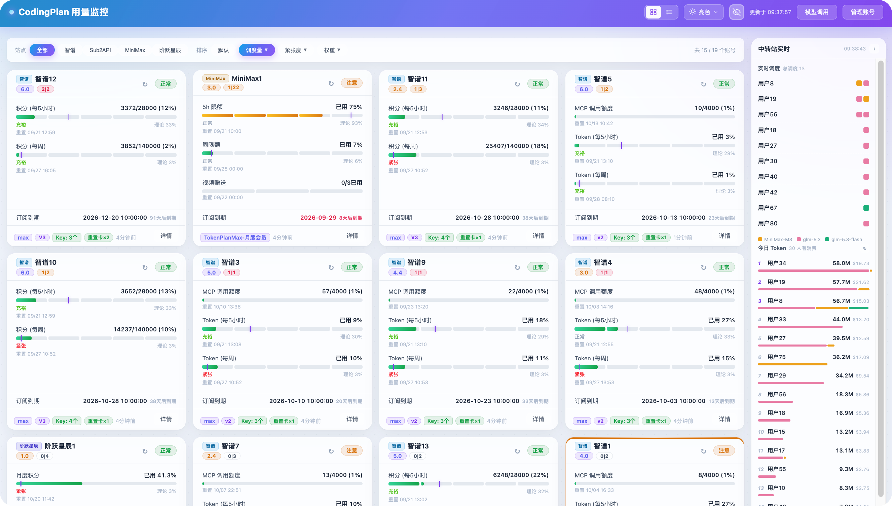

# GLM 用量监控

多账号 API 用量监控面板,支持 **智谱 GLM(bigmodel.cn)**、**YesCode(co.yes.vg)**、**Sub2API 中转站(任意 sub2api 部署站点)**、**火山(AgentPlan / CodingPlan 同一登录会话)**、**智云(token.telecomjs.com)**、**千问(platform.qianwenai.com)**、**MiniMax(platform.minimaxi.com)**、**阶跃星辰(platform.stepfun.com)** 等账号,以卡片 + 用量曲线的形式集中展示额度消耗、余额、订阅到期、API Key 管理。

## 效果展示



## 项目结构

```
glm-usage/
├── src/                        # 后端源码(按域拆分)
│   ├── server.js               # Express 入口:静态托管 + 挂载 api 中间件
│   ├── config.js               # 配置中心:加载 .env 并导出不可变配置
│   ├── weights.js              # 权重评分纯函数(供 /api/weights 与中转站)
│   ├── telecomjs.js            # 智云抓取(Chromium 执行瑞数挑战)
│   ├── minimax-proxy.js        # MiniMax 反向代理(env gating)
│   ├── lib/                    # 无业务依赖的基础件
│   │   ├── http.js             #   HTTP 助手(超时/JSON/非 2xx 抛错)
│   │   ├── crypto.js           #   凭证加解密(AES-256-GCM)
│   │   └── util.js             #   通用小工具(补零等)
│   └── api/
│       ├── index.js            # 中间件组装:按域注册路由 + 单测导出
│       ├── accounts.js         # accounts.json 读写(凭证自动加解密)
│       ├── auth.js             # 管理密码防爆破 + 鉴权中间件
│       ├── cache.js            # 用量缓存(5min TTL/落盘/防抖写/去重抓取)
│       ├── platforms/          # 各平台适配器(新增平台在此登记)
│       │   ├── index.js        #   平台分派 fetchAccountUsage / fetchAccountExpire
│       │   ├── glm.js          #   智谱(bigmodel.cn)
│       │   ├── yescode.js      #   YesCode(co.yes.vg)
│       │   ├── sub2api.js      #   Sub2API 中转站(任意部署站点)
│       │   ├── volc.js         #   火山(AgentPlan / CodingPlan)
│       │   ├── qwen.js         #   千问(platform.qianwenai.com)
│       │   ├── minimax.js      #   MiniMax(platform.minimaxi.com)
│       │   ├── stepfun.js      #   阶跃星辰(platform.stepfun.com)
│       │   └── telecom.js      #   智云(token.telecomjs.com)
│       └── routes/             # HTTP 路由(按域拆分)
│           ├── auth.js         #   登录(防爆破)
│           ├── features.js     #   功能开关
│           ├── usage.js        #   用量查询(秒回 + 后台补齐)
│           ├── credentials.js  #   凭证导出(env gating)
│           ├── weights.js      #   权重接口 + 权重配置
│           ├── relay.js        #   中转站容量/实时面板快照代理
│           ├── keys.js         #   智谱 Keys / IP 白名单 / 风控 / 重置卡
│           ├── telecom-login.js#   智云扫码登录
│           ├── accounts.js     #   账号管理 CRUD
│           ├── model-usage.js  #   用量曲线
│           └── expire.js       #   订阅到期
├── accounts.json          # 账号凭证(运行时自动生成,敏感,.gitignore 已忽略)
├── .env.example           # 环境变量模板(复制为 .env 后生效,.gitignore 已忽略)
├── Dockerfile             # 容器镜像构建(node:22-alpine)
├── docker-compose.yml     # 一键编排(.env 注入 + ./data 数据持久化)
├── package.json
├── test/                  # 单元测试(node --test,本地跑,不入库)
└── public/
    ├── index.html         # 前端监控面板(结构 + 样式)
    ├── js/                # 前端脚本(按职责拆分)
    │   └── echart/
    │       └── echarts.min.js # 用量曲线依赖(本地,可离线)
```

## 快速开始

```bash
npm install
cp .env.example .env       # 可选:按需修改 .env 中的端口 / 密码
npm start
# 默认 http://localhost:4000
```

首次启动会自动创建空的 `accounts.json`,无需手动准备数据文件。打开页面后点击右上角 **「管理账号」**,逐个录入账号即可(支持粘贴浏览器 fetch / cURL 命令自动解析凭证),后端落盘到 `accounts.json`。

## 配置

通过 `.env` 文件配置,模板见 `.env.example`(`cp .env.example .env` 后生效)。`.env` 已加入 `.gitignore`,不会提交。所有项均有默认值:

| 变量 | 默认值 | 说明 |
|------|--------|------|
| `PORT` | `4000` | 监听端口 |
| `HOST` | `0.0.0.0` | 监听地址,默认允许局域网访问 |
| `ADMIN_PASSWORD` | `123456` | 管理密码(账号增删改、Key 复制/创建/删除需校验) |
| `ACCOUNT_SECRET` | 空 | 账号凭证加密密钥(AES-256-GCM)。建议 `openssl rand -base64 32` 生成,**本地与服务器保持一致**才能互拷 `accounts.json`;未配置时从 `ADMIN_PASSWORD` 派生(此后改管理密码会导致旧密文解不开,解不开时按明文兜底并告警) |
| `ACCOUNTS_FILE` | `./accounts.json` | 账号数据文件路径(Docker 持久化用,本地留空) |
| `NODE_ENV` | `development` | 运行环境 |
| `TELECOMJS_CHROME_PATH` | 自动发现 | 智云抓取所用 Chrome/Chromium 可执行文件路径 |
| `SUB2API_BASE_URL` | 空(不启用) | sub2api 中转站地址;配置后启用容量胶囊与实时调度/今日Token 面板(需中转站具备 weight-snapshot / user-activity-snapshot / user-usage-snapshot 快照端点,lwsub2api 分支提供) |
| `RELAY_SNAPSHOT_TOKEN` | 空 | 中转站用户活动快照门禁,与中转站 `ACTIVITY_SNAPSHOT_TOKEN` 一致;留空表示中转站未开启门禁 |
| `MODELS_GATEWAY_URL` | 空(不启用) | 模型调用页(`models.html`)网关地址(OpenAI 兼容入口,含 `/v1`);配置后页面可用,留空禁用 |
| `CREDENTIALS_EXPORT` | 空(关闭) | 凭证导出接口 `/api/credentials` 开关(供中转站外部渠道同步登录态),接受 `1/true/yes`;留空则路由不注册 |
| `MINIMAX_PROXY_UPSTREAM` | 空(关闭) | MiniMax 反向代理 `/minimax/*` 上游地址(兼容保留,模型调用页已直连网关);留空则代理返回 404 |

`.env` 示例:

```env
PORT=4000
HOST=0.0.0.0
ADMIN_PASSWORD=my-secret
```

> 仍可用命令行 / 系统环境变量覆盖(`PORT=5000 npm start`),优先级:系统环境变量 > `.env` > 默认值。
> 浏览器验证通过后,密码保存在本地 `localStorage`,仅在当前浏览器生效。

## Docker 部署

镜像基于 `node:22-alpine`,并安装 Chromium 供智云页面完成瑞数校验。账号数据通过宿主机 `./data` 目录持久化,`.env` 通过 `env_file` 注入容器。

```bash
cp .env.example .env          # 先准备 .env 并修改 ADMIN_PASSWORD
docker compose up -d --build  # 构建并后台启动
# 访问 http://localhost:4000

docker compose logs -f        # 查看日志
docker compose down           # 停止并移除容器(./data 账号数据保留)
```

说明:
- 改 `.env` 的 `PORT` 后,`docker-compose.yml` 的端口映射会自动跟随(两端均读 `${PORT}`);生效需重建:`docker compose up -d`。
- 账号数据落盘在宿主机 `./data/accounts.json`,容器删除/重建不丢失;彻底清空请删除 `./data` 目录。
- `.env` 不会被打入镜像(`.dockerignore` 已排除),密码只存在于运行时环境。

### 一键脚本 deploy.sh

封装了上述常用操作,免去记忆 docker compose 参数:

```bash
./deploy.sh start     # 构建并启动
./deploy.sh stop      # 停止并移除容器(./data 数据保留)
./deploy.sh restart   # 重启(不重新构建)
./deploy.sh status    # 查看状态
./deploy.sh logs      # 查看日志(Ctrl+C 退出不停止服务)
./deploy.sh update    # git pull + 重新构建启动
```

## 账号类型与凭证

在面板右上角「管理账号」中添加,支持粘贴 fetch / cURL 命令自动解析。

| 平台 | 必填凭证 | 抓取方式 |
|------|----------|----------|
| 智谱 GLM | `authorization`(JWT)、`organization`、`project`；可选 `glm_username` + `glm_password` | bigmodel.cn 任意请求头中的 `authorization` / `bigmodel-organization` / `bigmodel-project`；填了账号密码时 token 过期（401/403/405）会自动重新登录并回写 JWT |
| YesCode | `cookie` 与 `yescode_username` + `yescode_password` 至少一项(推荐账密) | co.yes.vg 请求中的完整 `Cookie`,或登录接口(auth/login)的 fetch(自动解析账密)。官方 Cookie 有效期仅 24h,配了账密后失效自动重登并回写,无需再手动抓 Cookie |
| Sub2API 中转站 | `base_url`；`authorization` 与 `sub2api_email` + `sub2api_password` 至少一项(推荐账密)；可选 `alias` 站点别名 | 任意 sub2api 部署站点(如 super-nb.me / ai98pro.xyz)。粘贴登录接口或控制台请求的 fetch/cURL,自动识别站点并解析账密。并行抓取 `auth/me`(余额)、`subscriptions`(订阅)、`usage/dashboard/stats`(今日/累计 Token 与费用);卡片以余额 + 今日用量为主,过期超 3 天的订阅自动隐藏。token 24h 失效自动重登。旧火狸账号自动兼容(回退 huolilink.com 与 `huoli_*` 字段) |
| 火山(AgentPlan=火山A / CodingPlan=火山C) | `cookie`、`csrf`、可选 `web_id`、`planType` | console.volcengine.com 请求(用 cURL 复制带出完整 Cookie);添加账号时选套餐类型:AgentPlan 抓 `GetAgentPlanAFPUsage`,CodingPlan 抓 `GetCodingPlanUsage`。两者同一登录会话,Cookie/CSRF 共用 |
| 智云 | `satoken`、`phone` | 可手动填写 token.telecomjs.com 请求头中的 `Satoken`;认证失效时卡片会提供重新登录入口，用户核对账号登记手机号后使用官方二维码扫码登录，成功后自动回写。扫码页会自动勾选「一周内自动登录」（若未勾选）。后端通过 Chrome 执行页面及瑞数脚本并查询余额 |
| MiniMax | `cookie`、可选 `group_id` | platform.minimaxi.com 任意请求的完整 Cookie(含 `_token` 登录态);`group_id` 取请求头 `x-group-id`,留空时自动取 Cookie 中的 `minimax_group_id_v2`。套餐名称与到期时间从消息盒子(`message_category=4` 权益发放通知)解析;5h 限额 / 周限额(均百分比)与视频赠送 / 视频周赠(均计数)从 `remains_percent` 接口解析 |
| 阶跃星辰 | `cookie`、可选 `stepfun_webid` | platform.stepfun.com 任意请求的完整 Cookie(建议 Copy as cURL,须含 `Oasis-Token` 双段 JWT 与 `_wafdytokenv1`);`webid` 取请求头 `oasis-webid`,留空时自动取 Cookie 中的 `Oasis-Webid`。抓 Connect RPC 接口:`GetStepPlanStatus`(套餐)、`QueryStepPlanRateLimit`(月度积分限额)、`QueryStepPlanUsages`(今日/曲线用量)、`QueryAccountBalance`(按量余额)、`GetCampaignInviteLink`+`ListCampaignInvites`+`GetCampaignStatus`(邀请活动:详情页展示邀请码/链接复制、邀请进度、邀请记录与奖励账本,已邀满时复制会提醒名额已用完)。access 段仅 30 分钟,过期自动用 refresh 段(~30 天,不轮换)续期并回写 Cookie 中的 `Oasis-Token` 段 |

## 后端 API

`src/api/` 以 `/api` 为前缀暴露以下接口(供前端 `index.html` 调用):

| 方法 | 路径 | 鉴权 | 说明 |
|------|------|------|------|
| POST | `/api/auth` | - | 校验管理密码 |
| GET  | `/api/features` | - | 功能开关上报(`relayEnabled` / `modelsGatewayUrl`),前端据此决定可选集成功能是否渲染 |
| GET  | `/api/usage` | - | 全部账号用量(秒回:新鲜缓存直接返回,缺失/强刷时先返回旧数据或 loading 骨架并后台抓取;前端再按卡补齐) |
| GET  | `/api/usage/:index` | - | 单账号用量(可 join 列表触发的进行中抓取) |
| GET  | `/api/keys/:index` | - | 智谱账号 API Key 列表 |
| GET  | `/api/keys/:index/copy/:apiKey` | ✅ | 复制 Key 明文 |
| POST | `/api/keys/:index` | ✅ | 创建 Key |
| DELETE | `/api/keys/:index/:apiKey` | ✅ | 删除 Key |
| GET  | `/api/accounts` | ✅ | 账号列表 |
| POST / PUT / DELETE | `/api/accounts[/:index]` | ✅ | 账号增改删 / 整体排序 |
| GET  | `/api/model-usage/:index?period=today\|7d\|30d` | - | 用量曲线(智谱当日/7/30 天、千问、MiniMax 与阶跃 7/30 天,阶跃纵轴为积分) |
| GET  | `/api/expire[/:index]` | - | 订阅到期时间(24 小时缓存) |
| GET  | `/api/weights` | 可选密码 | 公开账号 token 分配权重(0~10,纯读缓存) |
| GET  | `/api/relay/activity` | ✅ | 中转站实时调度快照(占用/排队 + 近跑模型,代理中转站 `/api/user-activity-snapshot`,10s 缓存);`SUB2API_BASE_URL` 未配置时返回 404 |
| GET  | `/api/relay/usage` | ✅ | 中转站今日用量榜单(站内 + 外部资源合并、按模型明细,代理 `/api/user-usage-snapshot`,4 分钟缓存,`force=1` 旁路);`SUB2API_BASE_URL` 未配置时返回 404 |
| GET  | `/api/credentials` | ✅ | 凭证导出(按平台返回 `{账号名: 凭证}`,供中转站外部渠道同步登录态);**默认关闭**,`.env` 配置 `CREDENTIALS_EXPORT=1` 后才注册 |

鉴权接口通过请求头 `X-Auth-Password` 传递管理密码。

## 权重接口(`/api/weights`)

为中转站提供 token 分配权重:返回 `{ "账号名": 权重, ... }`,**权重 0~10**,越高越宽裕、可多分配 token,0 = 已耗尽。

**缓存依赖(关键)**:接口纯读内存缓存评分,**绝不会因调用而向 bigmodel.cn 刷新**。缓存由「打开监控面板 → `/api/usage`」填充,5 分钟 TTL。

**默认权重兜底**:token 失效 / 无缓存时,该账号按其「默认权重」配置返回(而非跳过)。默认权重初值 1,可逐账号配置。

智云按量账号会出现在权重接口和权重配置中。扫码登录是内存中的临时会话，5 分钟后自动过期；创建会话前必须输入与账号 `phone` 字段一致的手机号。二维码由智云官方页面提供，本项目只保存最终返回的 `satoken`。

**密码分层**:
- 不带密码:`GET /api/weights` → 公开账号(`isPublic !== false`,未明确设为私有即默认公开)
- 带正确密码:`GET /api/weights?password=<ADMIN_PASSWORD>` → 全部账号
- 明细:`GET /api/weights?password=<PWD>&detail=1` → `{ weights, detail:[...], generatedAt, cacheTtlMs }`(需密码)；智云明细额外包含 `remainingDays`、`averageDaily`、`capacityScore`、`codingPressure`、`timeMultiplier`、`peak`

**计算流程**:
1. **CodingPlan base(0~6)**:各平台按 5 小时、周、月等有效窗口的实际消耗速度与理论进度评分，取最紧张窗口；任一有效窗口耗尽则为 0
2. **余额兜底(YesCode / Sub2API)**:订阅额度耗尽但账号仍有可用余额(按量付费/推荐积分)时不整账号清零——耗尽窗口降为 1 分,并按余额量级(`≥$100/50/20/10/5` → `6/5/4/3/2`,其余 1)附加「余额」窗口;Sub2API 已过期的订阅不再作为约束,纯按余额打分。无余额且耗尽仍为 0
3. **智云 base**:`(账户余额 + 赠金) ÷ 近7日有消费日期的日均消费` 得到预计可用天数，按 `<7 / <14 / <30 / <60 / <90 / ≥90 天` 映射为容量分 `1~6`；再乘 CodingPlan 压力系数 `1 + (6 - CodingPlan平均基础分) / 6`，最后按中国时间 `14:00~18:00` 乘 `2`，其他时段乘 `0.5`。余额为 0 时恒为 0；有余额但暂无历史消费时容量分为 6
4. **策略**(在 base 上叠加,默认 B 倍率 ×1)
5. **兜底**:base 为 null 时直接用默认权重
6. **钳制**:最终结果统一 `clamp [0, 10]` 并保留 1 位小数

**权重策略**(每账号可配,管理员):

| 策略 | 含义 | 计算(base 已知时) |
|------|------|------|
| A 固定值 | 直接返回设定值 | `value` |
| B 倍率(默认 ×1) | 按倍率缩放 | `base × value` |
| C 最高值 | 上限钳制 | `min(base, value)` |
| D 固定加减 | 增减 | `base + value` |

**配置接口**(管理员,请求头 `X-Auth-Password`):
- `GET /api/weights/config` → `[{index, name, platform, config:{defaultWeight,strategy,value}, base, final}]`
- `PUT /api/weights/config/:index`,body `{defaultWeight?, strategy?, value?}`(任选提供)→ 写入该账号 `weightConfig`(存 `accounts.json`,编辑账号时自动保留)

**前端**:管理员登录后,每张卡片左上角显示 `W {最终权重}` 徽标(配色:0 红 / 1-3 橙 / 4-7 蓝 / 8-10 绿),点击弹出权重配置(默认权重 + 策略 + 策略值 + 实时预览),保存后徽标即时刷新;非管理员不显示。

## 前端功能

- 卡片视图:各账号额度进度、紧张度(实际用量 vs 理论进度)、重置时间、订阅到期倒计时;Sub2API 卡片以余额 + 今日用量为主(余额徽章 / 今日Token / 今日费用),过期超 3 天的订阅自动隐藏
- **中转站实时面板(管理员)**:右侧常驻栏展示中转站全部用户 —— ①实时调度(每个在跑调度一个色块,颜色按**实际调用模型**分配——`glm-5.3` 直连与 `glm-5.3 → glm-5.3-flash` 转发为两种颜色,悬浮显示映射,下方图例;15s 轮询);②今日 Token 排行(默认前 5,点「更多」展开全部;进度条按模型**多色堆叠**;站内 + `/admin/external-resources` 外部资源用量合并成完整榜单,外部部分带「外 N」徽标;5 分钟刷新一次,标题行 ↻ 手动刷新)。可折叠(状态记忆,折叠时卡片区占满),隐私模式下遮蔽用户名,窄屏自动堆叠到卡片下方;拉取失败保留最近数据并标红时间戳。**模型颜色按模型名固定分配**(哈希定槽 + 本地持久化,不随在线模型集合变化而漂移;亮/暗主题各一套已校验色阶)。**仅当 `.env` 配置了 `SUB2API_BASE_URL` 时展示**(容量胶囊同理),未配置时面板与胶囊不渲染、不轮询
- 模型调用页(右上角「模型调用」):网关地址由服务端 `MODELS_GATEWAY_URL` 注入(只读);未配置时页面禁用并提示
- 智谱个人账号重置提醒:周用量达到 60%、未耗尽、明显超出理论进度，且预计会在官方重置前至少停用 1 天时标记「需要重置」；仅排除已勾选「团队版」(type=2) 的账号与任一额度已耗尽的账号（不以 JWT `user_type=ENTERPRISE` 判定，个人订阅号的 JWT 也可能是 ENTERPRISE）
- 站点筛选(全部 / 智谱 / YesCode / Sub2API / 火山 / 智云 / 千问 / MiniMax / 阶跃星辰,Sub2API 角标显示站点别名)+ 紧张度排序
- 详情弹窗:负责人信息、余额、消费周期、API Key 表格、用量曲线(echarts)
- 深色模式(从按钮处径向扩散动画)+ 隐私模式(隐藏账号名)
- 账号管理:拖拽排序、粘贴 fetch/cURL 快速导入

## 注意事项

- `accounts.json` 与 `.env` 均含敏感信息,切勿提交到公开仓库(均已加入 `.gitignore`);`accounts.json` 删除后重启会自动重建空文件。其中账号的密码 / Cookie / Token 类字段(`glm_password`、`yescode_password`、`sub2api_password`、`cookie`、`authorization`、`satoken`)落盘前会以 AES-256-GCM 加密(密文前缀 `enc:v1:`),密钥取 `ACCOUNT_SECRET`(未配置则从 `ADMIN_PASSWORD` 派生);读取时自动解密,前端无感知。历史明文字段在下次保存该账号时自动转为密文。
- 所有对 bigmodel.cn / co.yes.vg / 各 sub2api 站点的请求由服务端代理转发,浏览器不直接持有凭证。
- 管理密码防爆破:同一 IP 连续输错 3 次封禁 15 分钟(内存计数,重启清零),期间即使密码正确也返回 429;`/api/weights`、`/api/credentials` 仅在**带了错误密码**时计入(中转站不带密码轮询不受影响)。
- 凭证(JWT / Cookie / Token)会过期,失败时面板显示「请求失败」;智谱若配了登录账号密码会在 401/403/405 时自动重登并回写 JWT,否则需重新抓 token;YesCode 官方 Cookie 有效期仅 24h,配了账密会自动重登续期;Sub2API token 同为 24h,配了账密自动续登;火山需重抓 Cookie/CSRF;智云认证失败时可从卡片核对手机号并重新登录，自动更新 Satoken；扫码时后端会尽量勾选天翼「一周内自动登录」;MiniMax 需重抓 Cookie;阶跃 Cookie 中的 access 段仅 30 分钟,后端会自动用 refresh 段续期并回写(建议整段 Copy as cURL 保留 `_wafdytokenv1` 等 WAF 段),refresh 段约 30 天过期,过期后需重抄完整 Cookie。
