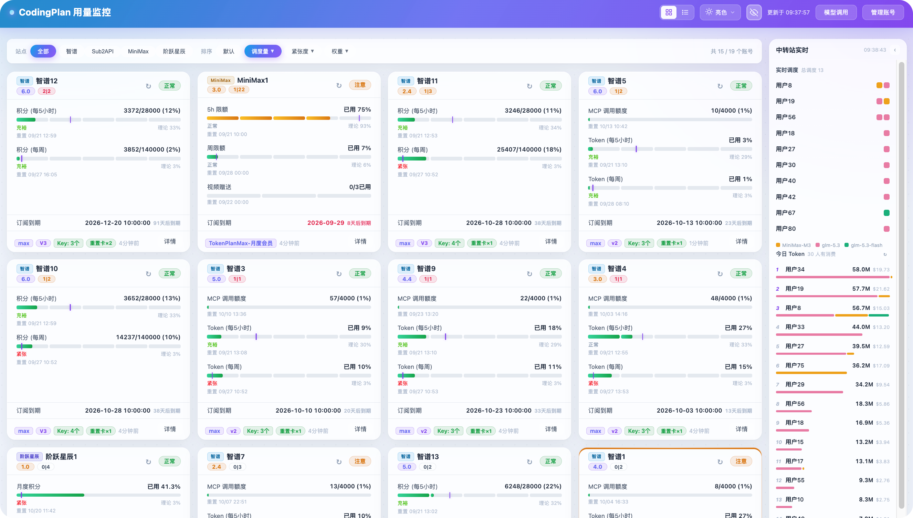

# Coding Plan 用量监控

<div align="center">

多账号 Coding Plan 用量监控面板:卡片 + 用量曲线集中展示各平台额度消耗、余额、订阅到期与 API Key 管理。


<table><tr>
  <td align="center"><a href="https://bigmodel.cn"><br /><b>智谱 GLM</b></a></td>
  <td align="center"><a href="https://co.yes.vg"><br /><b>YesCode</b></a></td>
  <td align="center"><br /><b>Sub2API</b></td>
  <td align="center"><a href="https://console.volcengine.com"><br /><b>火山引擎</b></a></td>
</tr><tr>
  <td align="center"><a href="https://token.telecomjs.com"><br /><b>智云·天翼</b></a></td>
  <td align="center"><a href="https://platform.qianwenai.com"><br /><b>通义千问</b></a></td>
  <td align="center"><a href="https://platform.minimaxi.com"><br /><b>MiniMax</b></a></td>
  <td align="center"><a href="https://platform.stepfun.com"><br /><b>阶跃星辰</b></a></td>
</tr></table>

</div>

## 效果展示



## ✨ 核心功能

- **多账号卡片面板**:额度进度、余额、5h / 周 / 月窗口紧张度(实际用量 vs 理论进度)、重置时间、订阅到期倒计时;站点筛选 + 紧张度排序
- **用量曲线**:ECharts 当日 / 7 天 / 30 天消耗趋势
- **智谱深度管理**:API Key 查看 / 复制 / 创建 / 删除、IP 白名单管理、风控异常提示、重置卡一键使用
- **凭证免维护**:智谱 / YesCode / Sub2API 配账密后 token 失效自动重登;阶跃 refresh 段自动续期;智云扫码重登
- **账号管理**:粘贴 fetch / cURL 自动解析凭证、拖拽排序;深色模式、隐私模式(访客脱敏)
- **安全**:凭证 AES-256-GCM 加密落盘,所有平台请求由服务端代理转发,浏览器不持有凭证;管理密码防爆破

## 📊 平台功能支持

| 平台 | 用量/额度 | 用量曲线 | 到期展示 | 免手动续期 | API Key 管理 | IP 白名单 | 风控提示 | 重置卡 |
|------|:---:|:---:|:---:|:---:|:---:|:---:|:---:|:---:|
| 智谱 GLM | ✅ | ✅ 当日/7/30 天 | ✅ | ✅ 账密重登 | ✅ | ✅ | ✅ 个人版 | ✅ 个人版 |
| YesCode | ✅ | — | — | ✅ 账密重登 | — | — | — | — |
| Sub2API 中转站 | ✅ 余额+今日用量 | — | ✅ | ✅ 账密重登 | — | — | — | — |
| 火山 A / C | ✅ | — | — | — | — | — | — | — |
| 智云·天翼 | ✅ 余额 | — | — | ✅ 扫码重登 | — | — | — | — |
| 通义千问 | ✅ | ✅ 7/30 天 | ✅ | — | — | — | — | — |
| MiniMax | ✅ 5h/周限额 | ✅ 7/30 天 | ✅ | — | — | — | — | — |
| 阶跃星辰 | ✅ 积分+余额 | ✅ 7/30 天·积分 | ✅ | ✅ 自动续期 | — | — | — | — |

> 全平台通用:权重徽标、深色模式、隐私模式;管理员另有控制台免登录直达(智谱 / MiniMax,配合油猴脚本)。

## 🚀 快速开始

**本地运行**

```bash
npm install
cp .env.example .env    # 可选:按需修改端口 / 密码
npm start
# 打开 http://localhost:4000
```

**Docker 部署**

```bash
cp .env.example .env                # 修改 ADMIN_PASSWORD
docker compose up -d --build
```

或使用一键脚本:`./deploy.sh start | stop | restart | status | logs | update`,详见 [docs/deployment.md](docs/deployment.md)。

## 🔑 添加账号

首次启动自动创建空的 `accounts.json`。打开页面 → 右上角 **「管理账号」** → 逐个录入:到对应平台控制台任意抓一个请求,Copy as fetch / cURL 粘贴进来即可自动解析凭证。

各平台所需凭证、抓取细节与自动续期说明见 **[docs/platforms.md](docs/platforms.md)**。

## ⚙️ 配置

复制 `.env.example` 为 `.env` 即可运行,所有项均有默认值。常用项:

| 变量 | 默认 | 说明 |
|------|------|------|
| `PORT` | `4000` | 监听端口 |
| `ADMIN_PASSWORD` | `123456` | 管理密码,**部署务必修改** |
| `ACCOUNT_SECRET` | 空 | 凭证加密密钥,建议 `openssl rand -base64 32`;本地与服务器一致才能互拷数据文件 |

全部环境变量(含隐私模式、中转站集成)见 **[docs/configuration.md](docs/configuration.md)**。

## 📚 文档

| 文档 | 内容 |
|------|------|
| [platforms.md](docs/platforms.md) | 各平台凭证获取、自动重登 / 续期、扫码登录、控制台直达 |
| [configuration.md](docs/configuration.md) | 全部环境变量与隐私模式详解 |
| [deployment.md](docs/deployment.md) | Docker 部署、deploy.sh 一键脚本、本地开发 |
| [api.md](docs/api.md) | 后端 API 一览与权重接口(/api/weights)完整逻辑 |
| [relay-integration.md](docs/relay-integration.md) | sub2api 中转站可选集成(实时面板 / 权重输出 / 凭证同步) |
| [development.md](docs/development.md) | 项目结构、新增平台指南、测试 |

## 🔒 安全说明

- `accounts.json` 与 `.env` 均含敏感信息,已加入 `.gitignore`,切勿提交;所有凭证类字段落盘前自动 AES-256-GCM 加密(密文前缀 `enc:v1:`)
- 所有对上游平台的请求由服务端代理转发,浏览器不直接持有凭证
- 管理密码防爆破:同一 IP 连续输错 3 次封禁 15 分钟
